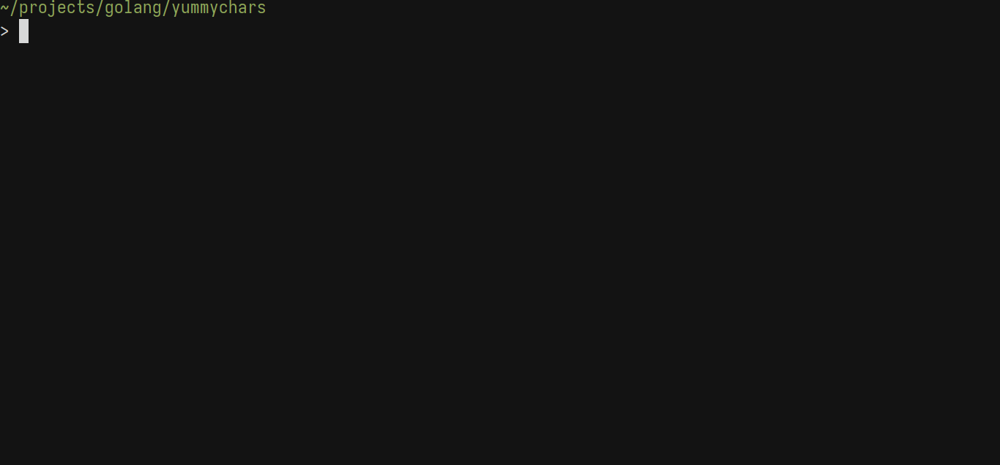

## yummychars


## What is this?
It's a silly game of snake in the terminal but with a twist; your current terminal
output is the "food" for the snake. If you have time on your hands and want a funny
terminal clearing activity, this is the one!

## How does it work?
It's simple; terminals traditionally don't have an API to access content that has
already been printed so this program relies heavily on tmux to use it's `capture-pane`
command to get that already printed content.  

With that, two identical buffers are kept in memory; one of the content that is printed
to the screen which includes all the ANSI escape sequences from the original tmux
`capture-pane` output and another of just the text from the terminal. The second is
need because if we try editing an ANSI escape sequence in place, it's a messy and
tiresome process of reconstructing the new changes back in place without breaking
and exposing other characters to the old ANSI sequences.  

With this second buffer, the snake can "eat" the characters and a function in
helpers.go allows us to map the characters to each other while ignoring the ANSI
escape sequences. So in reality the snake isn't "eating" the actual characters in
your terminal but is instead "eating" a copy which is then mapped to the one on
screen.  

Read a little on ANSI escape sequences; they're interesting!  

## How to use?
You'll need
* tmux
* go

with those two installed; start a tmux session (currently looking for a way to do
this without asking the user to launch a tmux session) and then do the following;
```
git clone https://github.com/willofdaedalus/yummychars
cd yummychars/
go build .
./yummychars
```
and that's it!
